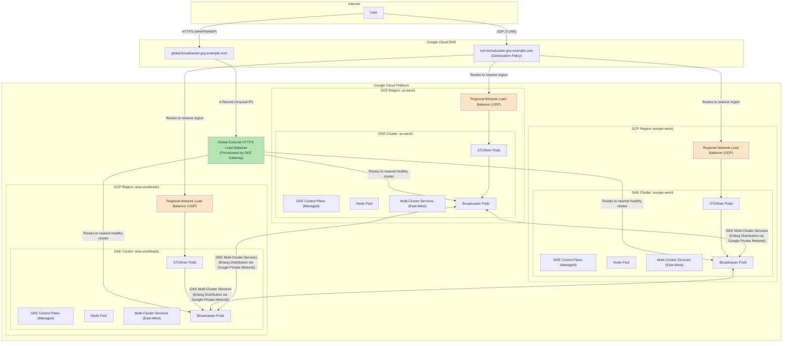

# Target Architecture on Google Cloud Platform

This document outlines the proposed architecture for migrating the multi-cluster Broadcaster application to Google Cloud Platform (GCP). The design leverages GCP managed services to enhance scalability, reliability, and operational efficiency, following modern cloud-native principles.

## Target Architecture Diagram

## Architectural Decisions

Here we summarize the key technology choices for the GCP migration.

*   **Compute: Google Kubernetes Engine (GKE)**
    *   **Replaces:** Self-managed `k3s` on VMs.
    *   **Rationale:** GKE is a managed Kubernetes service that handles the operational overhead of managing the control plane, scaling, and security. We can choose between **GKE Autopilot** for a hands-off, serverless-like experience, or **GKE Standard** for more fine-grained control over node configuration.

*   **Multi-Cluster Management: GKE Fleet**
    *   **Replaces:** Manual cluster configuration.
    *   **Rationale:** Registering our regional GKE clusters to a Fleet is the foundation for enabling multi-cluster capabilities like MCS and Gateway. It allows us to manage configurations and policies across clusters from a single place.

*   **East-West Traffic (Pod-to-Pod): Multi-Cluster Services (MCS)**
    *   **Replaces:** Cilium Cluster Mesh.
    *   **Rationale:** MCS provides native, DNS-based service discovery for services that need to span multiple clusters. This is the ideal solution for allowing the Broadcaster pods to form an Erlang Distribution cluster. All traffic between clusters stays on Google's private global network, enhancing security and performance.

*   **North-South Traffic (Signaling): GKE Gateway API & Global Load Balancer**
    *   **Replaces:** Nginx Ingress and Azure Traffic Manager (for HTTP).
    *   **Rationale:** The GKE Gateway API provisions a Global External HTTPS Load Balancer. This provides a single global anycast IP address, managed TLS certificates, and intelligent, latency-based routing to the nearest healthy GKE cluster. This simplifies the architecture while improving performance and resilience.

*   **North-South Traffic (Media): Network Load Balancer & Cloud DNS**
    *   **Replaces:** Exposing STUNner directly on the VM IP.
    *   **Rationale:** The WebRTC media path relies on STUN/TURN over UDP. A Global HTTPS Load Balancer is not suitable for this. The standard and most performant pattern is to expose the STUNner pods in each cluster using a Kubernetes `Service` of type `LoadBalancer`. This provisions a regional, high-performance L4 Network Load Balancer. We will then use **Cloud DNS** with a **geolocation routing policy** to direct users to the TURN server in the nearest region.

*   **Container Registry: Artifact Registry**
    *   **Replaces:** Building Docker images locally or using a different registry like GHCR.
    *   **Rationale:** Artifact Registry is GCP's managed service for storing and managing container images and other build artifacts. It integrates tightly with other GCP services like Cloud Build and GKE and provides vulnerability scanning.

*   **CI/CD: Cloud Build**
    *   **Replaces:** Manual deployment scripts (`install-nodes.sh`).
    *   **Rationale:** Cloud Build will enable a complete CI/CD pipeline defined in code. It will listen for changes in our GitHub repository, automatically build the Broadcaster Docker image, push it to Artifact Registry, and trigger a deployment to our GKE clusters. This is a core tenet of modern DevOps and SRE practice. 